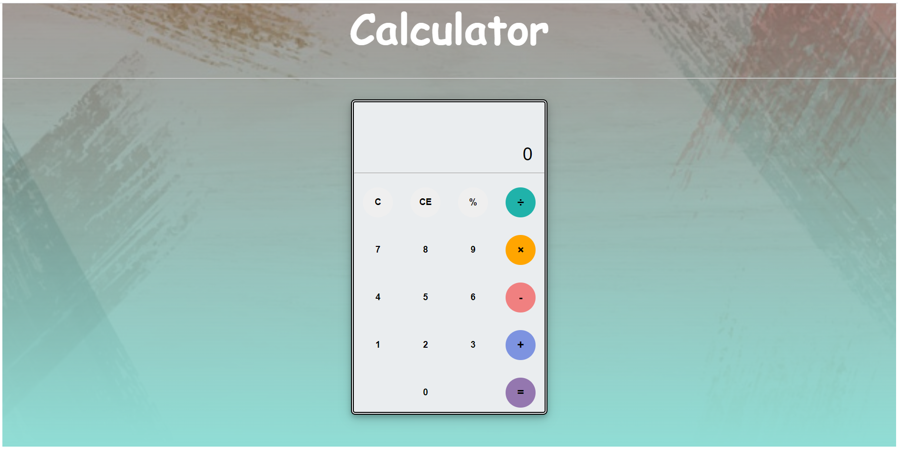

# Simple Javascript Calculator
 A javascript calculator used to perform basic arithmetic operations such as ***` + `*** ,  ***`-`*** , ***`*`*** , ***`/`*** ,***`%`***

 ## Keyboard controls
 - To enter numbers and operators in to the calculator, you can press their respective keys on keyboard
 - C Button - ESC Key
 - CE Button - Backspace/Delete key
 - "=" Button - Enter Key

 

 ## Try it out
 

 ## Technolgies used:
 - HTML
 - CSS
 - Javascript